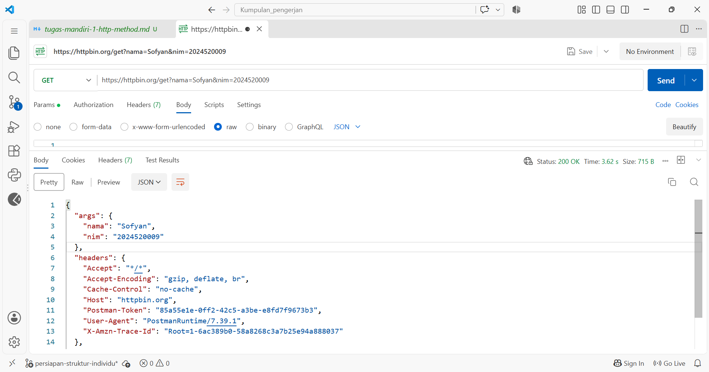
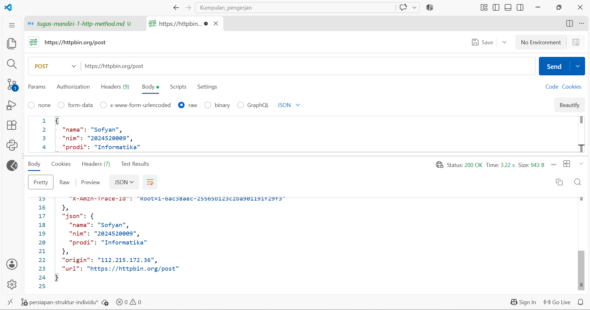
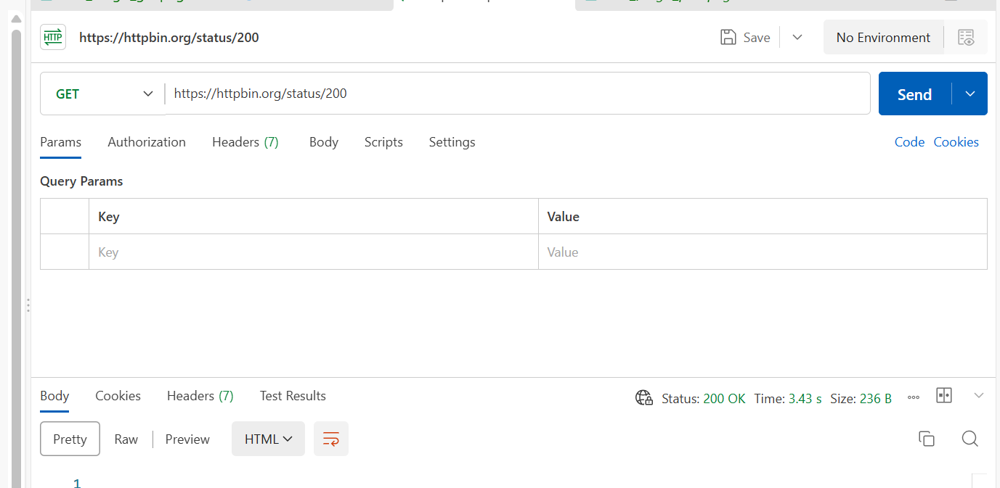
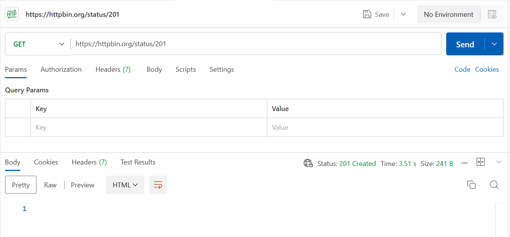
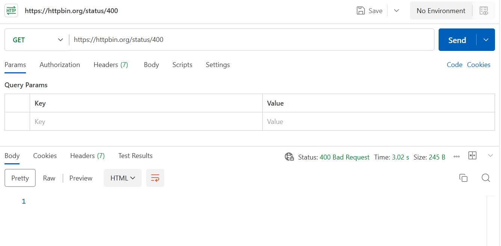
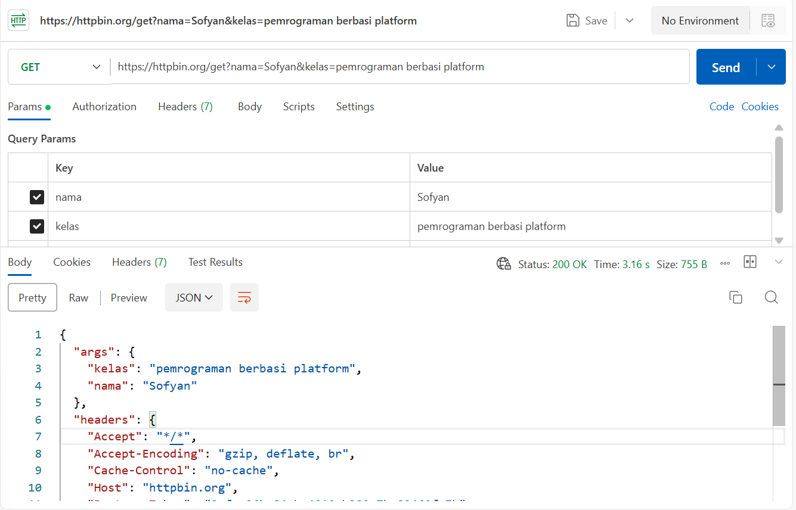
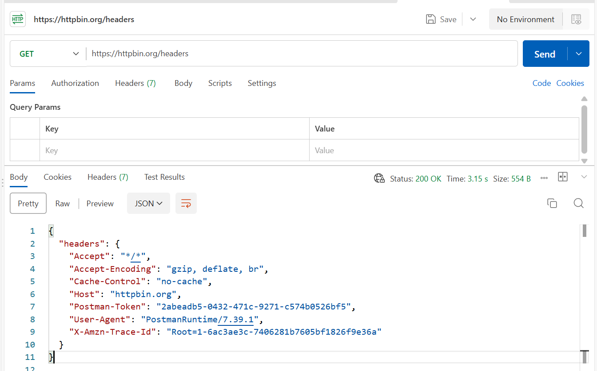

# Kegiatan Praktikum Pertemuan 02

## Judul

Pengujian HTTP Method, HTTP Status Code, Request & Response, serta Pengujian API dengan Postman dan curl

## Tujuan

Melakukan pengujian HTTP Method, HTTP Status Code, Request & Response (termasuk Headers), serta pengujian API menggunakan Postman dan command line (`curl`) untuk memahami proses komunikasi HTTP antara client dan server.

Pengujian dilakukan menggunakan HTTPBin sebagai layanan untuk melihat data request yang dikirim oleh client serta memahami status code dan response yang diberikan oleh server.

## Cara Menjalankan

Pengujian dilakukan menggunakan aplikasi Postman dan terminal/CLI dengan langkah-langkah berikut:

### Menggunakan Postman:
1. Membuka aplikasi Postman.
2. Membuat request HTTP sesuai dengan pengujian yang dilakukan.
3. Memasukkan URL HTTPBin.
4. Mengatur method, headers, dan parameter/body sesuai kebutuhan pengujian.
5. Mengirim request menggunakan tombol **Send**.
6. Mengamati status code dan response yang diberikan oleh server.
7. Menyimpan screenshot hasil pengujian sebagai bukti pengerjaan.

### Menggunakan curl:
1. Membuka terminal/command prompt.
2. Menjalankan perintah `curl` dengan opsi yang sesuai (`-i` atau `-s`) ke endpoint HTTPBin.
3. Mengamati header response, status code, dan response body yang ditampilkan.
4. Menyimpan screenshot hasil pengujian pada terminal sebagai bukti pengerjaan.

## Hasil

### 1. Pengujian GET

Request GET berhasil dikirim ke HTTPBin dan menghasilkan response dari server.

**Bukti hasil pengujian GET:**

### 2. Pengujian POST

Request POST berhasil dikirim ke HTTPBin dan menghasilkan response dari server.

**Bukti hasil pengujian POST:**

### 3. Pengujian HTTP Status Code

Pengujian HTTP Status Code dilakukan menggunakan endpoint:

`https://httpbin.org/status/:code`

Method yang digunakan adalah **GET**.

Pengujian dilakukan dengan beberapa status code untuk melihat response yang diberikan oleh server.

#### Status Code 200

#### Status Code 201

#### Status Code 400

### 4. Pengujian Request & Response (TM-3)

Pengujian Request dan Response mencakup pengujian fungsi GET serta pengiriman kustom HTTP Headers ke HTTPBin.

#### Pengujian Fungsi GET TM-3

#### Pengujian Headers TM-3

### 5. Pengujian API dengan Postman dan curl (TM-4)

Pengujian dilakukan untuk membandingkan request GET & POST pada Postman serta pengujian opsi `curl -i` dan `curl -s`.

#### Pengujian GET di Postman

#### Pengujian POST di Postman

#### Pengujian `curl -i`

#### Pengujian `curl -i /status/404`

#### Pengujian `curl -s`

## Lokasi Bukti

Bukti screenshot hasil pengujian disimpan pada folder:

`pertemuan-02/kegiatan-praktikum/`

### Bukti TM-1

- [tm1_fungsi_get.png](./tm1_fungsi_get.png)
- [tm1_fungsi_post.png](./tm1_fungsi_post.png)

### Bukti TM-2

- [tm_2_200.png](./tm_2_200.png)
- [tm_2_201.png](./tm_2_201.png)
- [tm_2_400.png](./tm_2_400.png)

### Bukti TM-3

- [tm_3_fungsi_get.png](./tm_3_fungsi_get.png)
- [tm_3_fungsi_headers.png](./tm_3_fungsi_headers.png)

### Bukti TM-4

- [tm_4_pengujian get di posmen.png](./tm_4_pengujian%20get%20di%20posmen.png)
- [tm_4_pengujian post di posmen.png](./tm_4_pengujian%20post%20di%20posmen.png)
- [tm_4_pengujian curl -i.png](./tm_4_pengujian%20curl%20-i.png)
- [tm_4_pengujian curl -i status404.png](./tm_4_pengujian%20curl%20-i%20status404.png)
- [tm_4_pengujian curl -s.png](./tm_4_pengujian%20curl%20-s.png)

## Laporan Tugas

### TM-1 — HTTP Method

[`tugas-mandiri-1-http-method.md`](../tugas-mandiri/backend/tugas-mandiri-1-http-method.md)

### TM-2 — HTTP Status Code

[`tugas-mandiri-2-status-code.md`](../tugas-mandiri/backend/tugas-mandiri-2-status-code.md)

### TM-3 — Request & Response

[`tugas-mandiri-3-request-response.md`](../tugas-mandiri/backend/tugas-mandiri-3-request-response.md)

### TM-4 — Pengujian API dengan Postman dan curl

[`tugas-mandiri-4-api-postman-curl.md`](../tugas-mandiri/backend/tugas-mandiri-4-api-postman-curl.md)